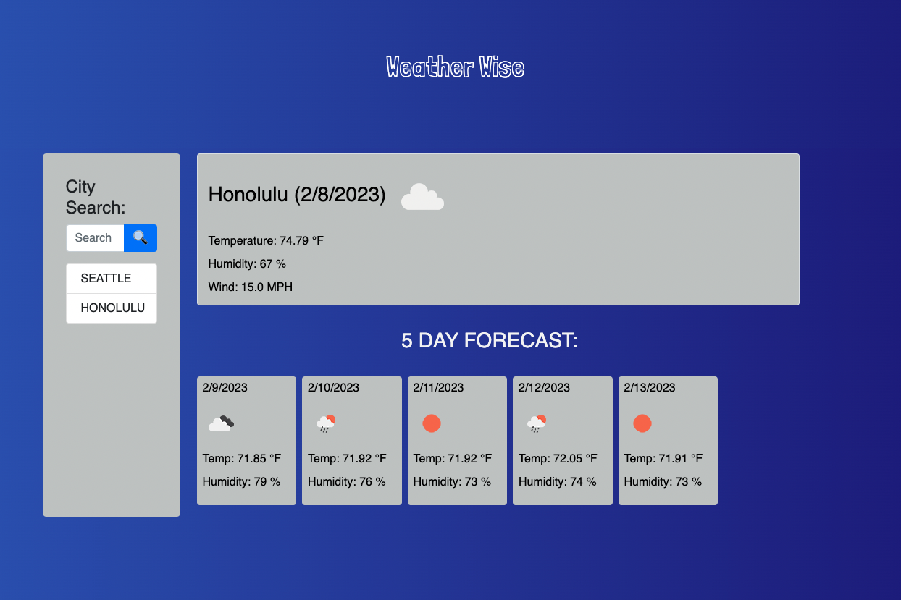

# WEATHER-WISE Forecast App

## Table of Contents
- [Description](#description)
- [Link to Website](#website-link)
- [Github Repository](#github-repo)
- [Screenshot](#screenshot)
- [Liscense](#license)

#
#
### Description
#### The purpose of this app is to provide a 5-day weather forecase using an API and local storage. Moment, JQuery, and OpenWeather API are used.

#

### Link to Website: [Weather Wise](https://adodt.github.io/weather-wise/)

### Github Repository: [Github Repo](https://github.com/adodt/weather-wise)

#
### Screenshot

#
### License [MIT](http://choosealicense.com/licenses/mit/)